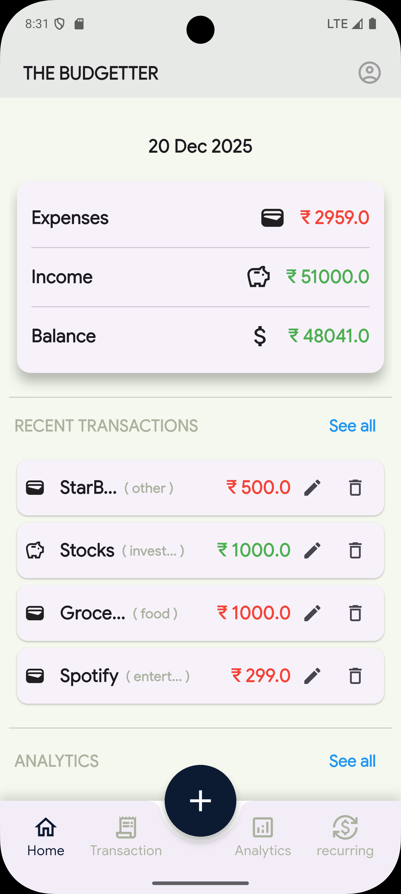
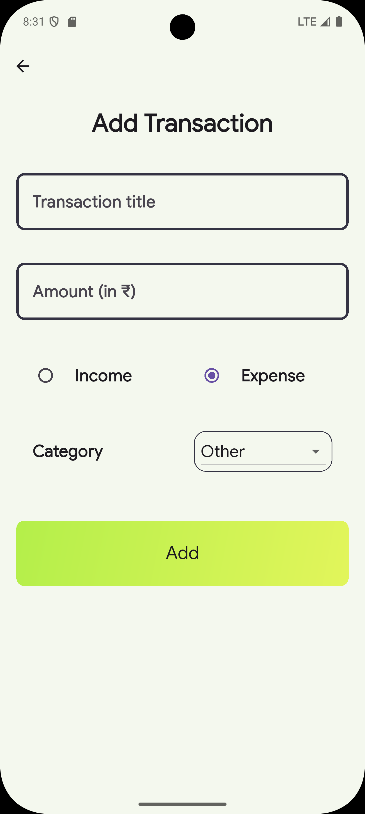
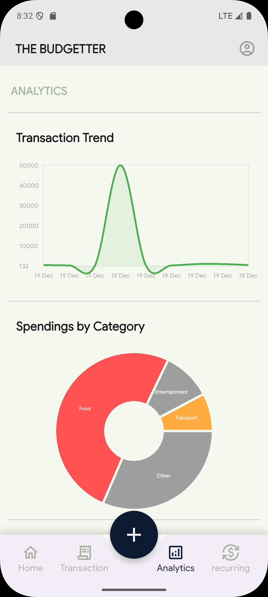
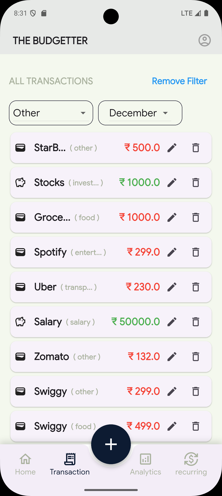

# 💰 Expense Tracker App

A high-performance, aesthetically pleasing Expense Tracker application built with Flutter. This app helps users manage their personal finances by tracking income and expenses, visualizing spending habits through analytics, and organizing transactions with categories.

Built using the **MVVM (Model-View-ViewModel)** architecture and **Riverpod** for robust state management.

---

## 📱 Screenshots

| Home Page | Add Transaction | Analytics | Transactions List |
|:---:|:---:|:---:|:---:|
|  |  |  |  |


---

## ✨ Key Features

* **Dashboard Overview:** View total balance, income, and expenses at a glance.
* **Transaction Management:**
    * **Add:** Quickly add income or expenses with details like title, amount, date, and category.
    * **Edit:** Update existing transaction details.
    * **Delete:** Remove unwanted transactions effortlessly.
* **Advanced Filtering:** Filter transactions by **Month** and **Category** (e.g., Food, Transport, Salary) to analyze specific spending patterns.
* **Visual Analytics:**
    * **Pie Chart:** Breakdown of expenses by category.
    * **Bar Chart:** Weekly spending trends.
    * **Line Chart:** Income vs. Expense trends over time.
* **Local Storage:** All data is persisted locally using **Hive**, ensuring privacy and offline access.
* **Responsive UI:** Designed with custom widgets and a centralized theme for a consistent user experience.

---

## 🏗️ Architecture

This project follows a strict **MVVM (Model-View-ViewModel)** architectural pattern to ensure separation of concerns, scalability, and testability.

### 1. Model Layer
* **Transaction Model:** Defines the data structure (ID, Title, Value, Type [Income/Expense], Category, Date).
* **Enums:** Defines strict types for Transaction Types and Categories (e.g., Food, Shopping, Investment).

### 2. ViewModel Layer (State Management)
* **Transaction Notifier Provider (Riverpod):** The core logic center. It handles:
    * Fetching transactions from the repository.
    * Business logic for Adding, Updating, and Deleting transactions.
    * Exposing the state (`AsyncValue<List<Transaction>>`) to the UI.
* **Page Navigation Provider:** A global provider that manages the active index of the Bottom Navigation Bar, allowing page toggling from anywhere in the app.

### 3. View Layer (UI)
* **Pages:**
    * `MainPage`: The skeleton holding the `AppBar` and `BottomNavigationBar`.
    * `HomePage`: Displays the dashboard and recent transactions.
    * `TransactionsPage`: A detailed list with filtering capabilities.
    * `AddTransactionPage`: Form for data entry.
    * `AnalyticsPage`: Visualizes data using graphs.
* **Custom Widgets:** Reusable components like `CustomTextField`, `CustomButton`, `CustomDropdown`, and `TransactionCard` located in the widgets folder.

### 4. Repository Layer
* **Hive Repo:** Handles direct interaction with the Hive database for CRUD operations.
* **Analytics Helper:** Contains logic to aggregate raw data into formats suitable for charts (e.g., calculating total spending per category).

---

## 🛠️ Tech Stack & Dependencies

* **Framework:** [Flutter](https://flutter.dev/) (SDK >=3.8.0)
* **Language:** Dart
* **State Management:** [Flutter Riverpod](https://pub.dev/packages/flutter_riverpod) (with `riverpod_generator`)
* **Local Database:** [Hive](https://pub.dev/packages/hive) & `hive_flutter`
* **Charts:** [FL Chart](https://pub.dev/packages/fl_chart)
* **Utilities:**
    * `uuid`: For unique transaction IDs.
    * `intl`: For date formatting.
    * `path_provider`: For accessing device storage paths.
* **Code Generation:** `build_runner` & `riverpod_generator`.

---

## 🚀 Getting Started

Follow these instructions to set up the project on your local machine.

### Prerequisites
* [Flutter SDK](https://docs.flutter.dev/get-started/install) installed.
* Android Studio or VS Code with Flutter extensions.
* An Android Emulator (e.g., Pixel) or an iOS Simulator.

### Installation Steps

1.  **Clone the Repository**
    ```bash
    git clone https://github.com/MohammedKareemullah/Flutter-Expense-Tracker-App.git
    cd Flutter-Expense-Tracker-App
    ```

2.  **Install Dependencies**
    Fetch all the required packages listed in `pubspec.yaml`.
    ```bash
    flutter pub get
    ```

3.  **Run Code Generator**
    Since this project uses `riverpod_generator` and `hive_generator`, you must run the build runner to generate the necessary files (e.g., `*.g.dart`).
    ```bash
    dart run build_runner build --delete-conflicting-outputs
    ```

4.  **Run the App**
    Launch your emulator and run the application.
    ```bash
    flutter run
    ```

---

## 📖 Usage Guide

### Managing Transactions
1.  Tap the **"+" (Add)** button on the Bottom Navigation Bar.
2.  Enter the title, amount, select the type (Income/Expense), and choose a category.
3.  Tap **"Add"** to save.
4.  To **Edit** or **Delete**, slide the transaction card in the list or tap the respective icons.

### Filtering Data
1.  Navigate to the **Transactions Page**.
2.  Use the **Month Dropdown** to see transactions for a specific month.
3.  Use the **Category Filter** to view only specific types of spending (e.g., "Food").
4.  The list updates instantly to reflect your filters.

### Viewing Analytics
1.  Navigate to the **Analytics Page**.
2.  **Pie Chart:** See which category consumes most of your budget.
3.  **Bar Chart:** Monitor your spending intensity over the last 7 days.
4.  **Line Chart:** Track the trend of your income vs. expenses.

---


## 📧 Contact

**Mohammed Kareemullah**
* GitHub: [MohammedKareemullah](https://github.com/MohammedKareemullah)
* Project Link: [Flutter Expense Tracker App](https://github.com/MohammedKareemullah/Flutter-Expense-Tracker-App)

